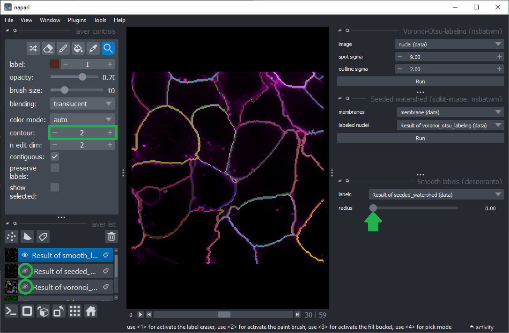

# Exercise: Seeded watershed in Napari

Start Napari and open the example image `File > Open Samples > Napari > Cells (3D+2Ch)`.

Use the menu `Tools > Segmentation / labeling > Voronoi Otsu Labeling` to segment the nuclei.

Use the menu `Tools > Segmentation / labeling > Seeded Watershed (scikit-image, nsbatwm)` to segment the cells.

Start `Smooth labels (clesperanto)` from the menu `Tools > Segmentation post-processing`. 
Hide all layers except the final cell segmentation. Change the `contour` of the cell segmentation layer to show the outlines of the segmented cells above the membrane channel.

Vary the radius and see how the outlines change.

## Question

What is a good radius for segmenting cells in this image properly?