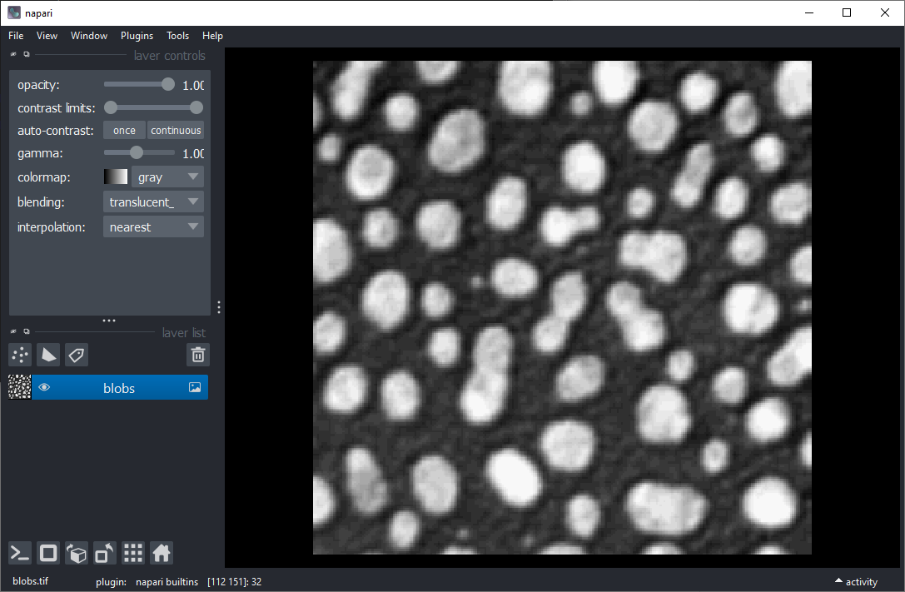
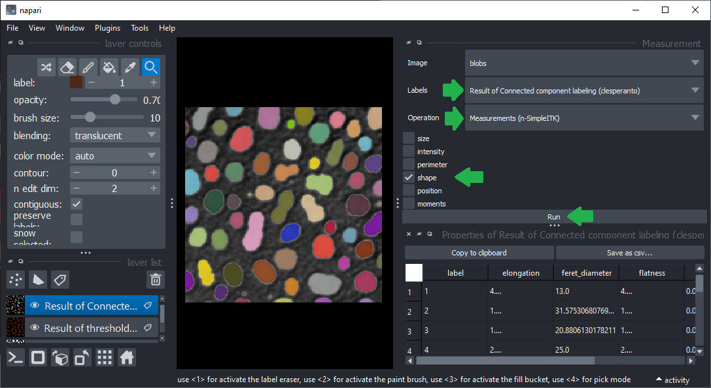
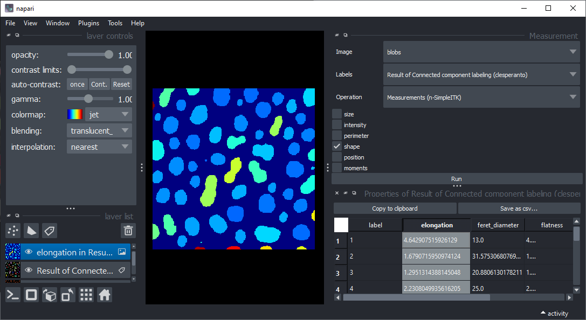

# Parametric map images in Napari

Start napari and open the example image `File > Open Samples > clEsperanto > Blobs (from ImageJ)`.

Start the Assistant from the menu `Tools > Utilities > Assistant (na)` and segment the blobs. Use the `Binarize` button, Threshold Otsu, the `Label` button and Connected Component Labeling.

Click the `Measurement button` in the Assistant. Close the Assistant to make some space for the measurement table.
Select `shape` measurements and click on `Run`.

Double-click on the table colum `elongation` to create a parametric map image representing elongation of the segmented objects.

## Optional exercise

Export a Python Jupyter notebook from the Napari session and open it in Jupyter Lab. Implement the feature extraction and parametric map generation ([hints](https://haesleinhuepf.github.io/BioImageAnalysisNotebooks/60_data_visualization/parametric_maps.html)).
