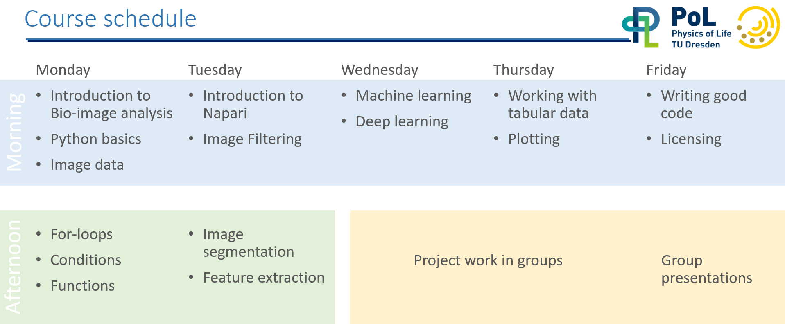

# Image data science with Python and Napari @EPFL

This [Jupyter book](https://jupyterbook.org/) contains training resources for scientists who want to dive into image processing with Python. 
It specifically aims for students and scientists working with microscopy images in the life sciences.
We presume the attendees have some basic programming and image analysis knowledge. 
To get everyone on the same level, we start with Python programming basics.
We will process images using [numpy](https://numpy.org), [scipy](https://www.scipy.org/), [scikit-image](https://scikit-image.org/), [SimpleITK](https://simpleitk.org/) and [clEsperanto](https://github.com/clEsperanto/pyclesperanto_prototype).
We will explore [Napari](https://napari.org) for interactive image data analysis and the [Napari-Assistant](https://github.com/haesleinhuepf/napari-assistant) for generating [Jupyter Notebooks](https://jupyterlab.readthedocs.io/en/stable/) from interactively designed image processing workflows. 
We will use [scikit-learn](https://scikit-learn.org/stable/) to process images using machine learning and deep learning techniques.
We then dive into working with tables and [matplotlib](https://matplotlib.org/) and [seaborn](https://seaborn.pydata.org/) for plotting results.
We will use unsupervised machine learning techniques to explore relationships between parameters extracted from biological imaging data. We will use these techniques interactively in the [Napari Clusters Plotter](https://github.com/BiAPoL/napari-clusters-plotter).
Last but not least we will learn about good scientific practice in the programming context, and sharing code, data and documentation best practices.


## Timetable



## How to use this material

For following the course, we recommend downloading [the repository from which this Jupyter book is made](https://github.com/BiAPoL/Image-data-science-with-Python-and-Napari-EPFL2022).
All Jupyter Notebooks are executable so that attendees can reproduce all demos and exercises.


Assuming you downloaded the repository to your Desktop, you can open the Jupyter book by opening a terminal and typing:

```bash
cd Desktop/Image-data-science-with-Python-and-Napari-EPFL2022

conda activate devbio-napari-env

jupyter lab
```

Using Jupyter lab, you can navigate to the course lessons in the `docs` folder.


... and execute the code and experiment with it.


## Feedback and support

If you have any questions, please use the anonymous etherpad (see email) or create a [github issue](https://github.com/BiAPoL/Image-data-science-with-Python-and-Napari-EPFL2022/issues).
Alternatively, open a thread on [image.sc](https://image.sc), put a link to the lesson or exercise you want to ask a question about and tag @haesleinhuepf.

## Acknowledgements

This course was held virtually at EPFL Lausanne in December 2022. We would like to thank Suliana Manley for the invitation, Edward Andò, Mallory Wittwer, Florian Aymanns for the local support and the EPFL Lausanne for financial support. 
We would like to thank all the people who shared teaching materials we are reusing here, in particular Anna Poetsch ([Biotec Dresden](https://tu-dresden.de/cmcb/biotec/forschungsgruppen/poetsch)), 
Benoit Lombardot (MPI-CBG Dresden), Martin Weigert (EPFL Lausanne) and Alexander Krull (U Birmingham).
We acknowledge support by the Deutsche Forschungsgemeinschaft under Germany’s Excellence Strategy—EXC2068–Cluster of Excellence Physics of Life of TU Dresden.


